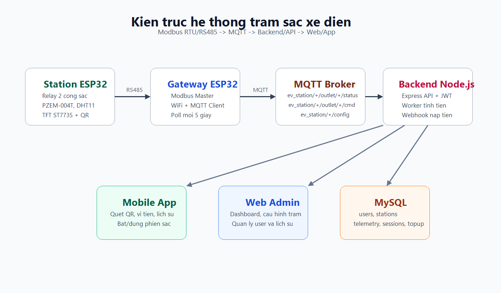
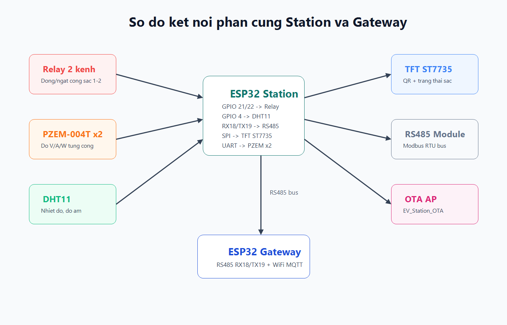

# Bao cao do an: He thong tram sac xe dien thong minh

## 1. Ten de tai

Thiet ke va xay dung mo hinh he thong tram sac xe dien co giam sat, dieu khien va thanh toan qua ung dung.

## 2. Muc tieu

De tai huong den viec xay dung mot mo hinh tram sac xe dien quy mo nho nhung co day du cac thanh phan cua mot he thong IoT: thiet bi do/dieu khien, gateway truyen thong, may chu backend, co so du lieu, web quan tri va ung dung di dong cho nguoi dung.

Muc tieu cu the:

- Dieu khien 2 cong sac tren mot tu sac bang relay.
- Do thong so dien qua cam bien PZEM-004T.
- Do nhiet do/do am trong tu bang DHT11.
- Hien thi ma QR va trang thai cong sac tren man hinh TFT.
- Truyen du lieu tu station ve gateway bang Modbus RTU/RS485.
- Truyen du lieu tu gateway len backend bang MQTT.
- Quan ly nguoi dung, vi tien, phien sac va lich su tren backend.
- Cung cap web admin va app di dong de thao tac voi he thong.

## 3. Pham vi thuc hien

Trong pham vi do an, he thong duoc xay dung voi mot gateway ESP32 va mot station ESP32 co 2 cong sac. Kien truc da duoc thiet ke de co the mo rong them nhieu station bang cach cau hinh them slave ID va topic MQTT tuong ung.

## 4. Kien truc he thong

He thong hoat dong theo hai chieu:

- Chieu giam sat: station cap nhat cam bien vao thanh ghi Modbus, gateway doc du lieu, publish MQTT, backend ghi database va hien thi len web/app.
- Chieu dieu khien: web/app goi API, backend publish MQTT command, gateway nhan lenh va ghi Modbus command xuong station, station dieu khien relay.

## 5. Thiet ke phan cung

Station ESP32 dam nhiem dieu khien truc tiep phan cong suat cua mo hinh. Cac module chinh gom:

- ESP32 DevKit.
- Module RS485 cho Modbus RTU.
- Cam bien cong suat PZEM-004T cho tung cong sac.
- Relay 2 kenh active LOW.
- Cam bien DHT11.
- Man hinh TFT ST7735.
- Nut BOOT de bat/tat WiFi AP OTA.

Gateway ESP32 ket noi WiFi va MQTT broker, dong thoi giao tiep RS485 voi station.

## 6. Thiet ke phan mem

### 6.1. Firmware Station

Firmware station nam trong `src/station/`. Cac nhiem vu chinh:

- Khoi tao relay o trang thai tat an toan.
- Hien thi QR `001.1` va `001.2` tren TFT.
- Doc DHT11 va PZEM theo chu ky.
- Cap nhat telemetry vao Modbus holding registers.
- Nhan lenh bat/tat cong sac tu gateway.
- Thuc hien bao ve qua dong, qua nhiet va maintenance.
- Ho tro OTA qua WiFi AP noi bo.

### 6.2. Firmware Gateway

Firmware gateway nam trong `src/gateway/`. Cac nhiem vu chinh:

- Ket noi WiFi.
- Ket noi MQTT broker.
- Doc Modbus station moi 5 giay.
- Publish telemetry len topic MQTT.
- Subscribe lenh dieu khien va cau hinh.
- Ghi command/config xuong station bang Modbus.

### 6.3. Backend

Backend nam trong `backend/server.js`, su dung Node.js, Express, MQTT, MySQL, JWT va bcrypt. Backend thuc hien:

- Xac thuc nguoi dung.
- Quan ly user/admin.
- Quan ly tram va cau hinh tram.
- Xu ly bat dau/dung phien sac.
- Tinh san luong va chi phi.
- Ghi telemetry va lich su.
- Xu ly webhook nap tien.
- Worker nen de giam sat mat ket noi, qua thoi gian, het tien va khong tai.

### 6.4. Web admin

Web admin nam trong `backend/public/index.html`. Giao dien cho phep:

- Dang nhap admin.
- Theo doi cong suat, trang thai tram, canh bao.
- Bat/tat cong sac.
- Cau hinh gia dien, nguong dong, nguong nhiet do, maintenance.
- Quan ly nguoi dung va lich su giao dich.

### 6.5. Mobile app

Ung dung nam trong `ev-user-app/`, xay dung bang Expo/React Native. Chuc nang chinh:

- Dang ky/dang nhap.
- Ghi nho dang nhap.
- Xem so du vi.
- Nap tien qua VietQR/webhook.
- Quet QR de chon cong sac.
- Bat/dung phien sac.
- Xem lich su sac va lich su nap tien.
- Quen mat khau qua OTP email.

## 7. Co so du lieu

Co so du lieu duoc mo ta tai `database.dbml`, gom cac bang:

- `users`
- `stations`
- `telemetry`
- `charging_sessions`
- `topup_history`

Thiet ke nay cho phep tach rieng thong tin nguoi dung, thong tin station, log telemetry va giao dich sac/nap tien.

## 8. Giao thuc truyen thong

He thong su dung Modbus RTU trong mang noi bo station-gateway va MQTT trong mang cloud/backend. Cach tach hai giao thuc giup station khong can ket noi Internet truc tiep, gateway dong vai tro cau noi giua tang thiet bi va tang dich vu.

## 9. Ket qua thuc hien

Ket qua minh hoa duoc dat trong thu muc `docs/ket-qua-demo/`.

| Noi dung | File minh hoa |
| --- | --- |
| Dashboard quan tri | `dashboard.png` |
| Ung dung di dong | `mobile-app.png` |
| Man hinh TFT station | `station-lcd.jpg` |
| Log Serial/Modbus/MQTT | `serial-monitor.png` |

## 10. Danh gia

He thong da dap ung cac muc tieu co ban cua de tai:

- Co truyen thong hai chieu giua thiet bi va server.
- Co dieu khien cong sac tu web/app.
- Co ghi nhan telemetry va lich su.
- Co logic tinh tien va quan ly vi.
- Co co che bao ve thiet bi.

Mot so han che:

- Can tach thong tin nhay cam ra khoi source code truoc khi public.
- Can bo sung migration SQL tu file DBML.
- Can bo sung test tu dong cho backend.
- MQTT hien dung broker public va port 1883, nen can nang cap bao mat khi trien khai that.

## 11. Huong phat trien

- Ho tro nhieu station/gateway dong thoi.
- Ma hoa MQTT bang TLS va xac thuc client.
- Them WebSocket de dashboard realtime hon.
- Them phan quyen chi tiet cho admin/operator/user.
- Dong goi backend bang Docker.
- Bo sung app release APK va huong dan cai dat cho nguoi dung cuoi.

## 12. Ket luan

Do an da xay dung duoc mot mo hinh tram sac xe dien thong minh co day du cac thanh phan IoT tu thiet bi, gateway, server den giao dien nguoi dung. He thong co kha nang giam sat, dieu khien, luu tru lich su va xu ly thanh toan, dong thoi co kha nang mo rong de phuc vu cac kich ban tram sac lon hon.
