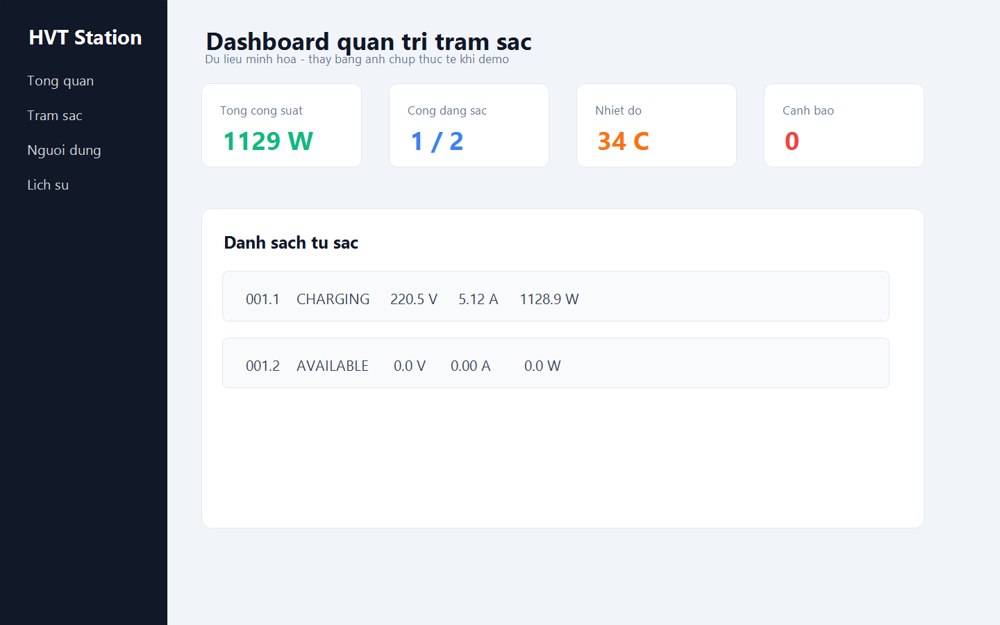
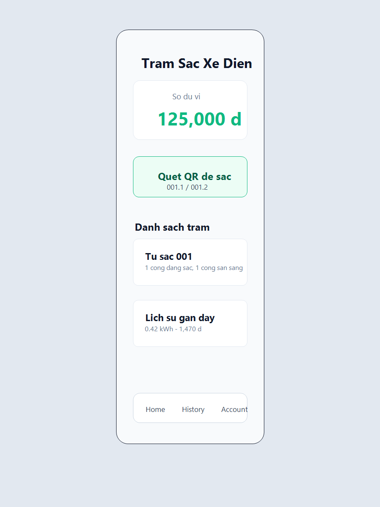
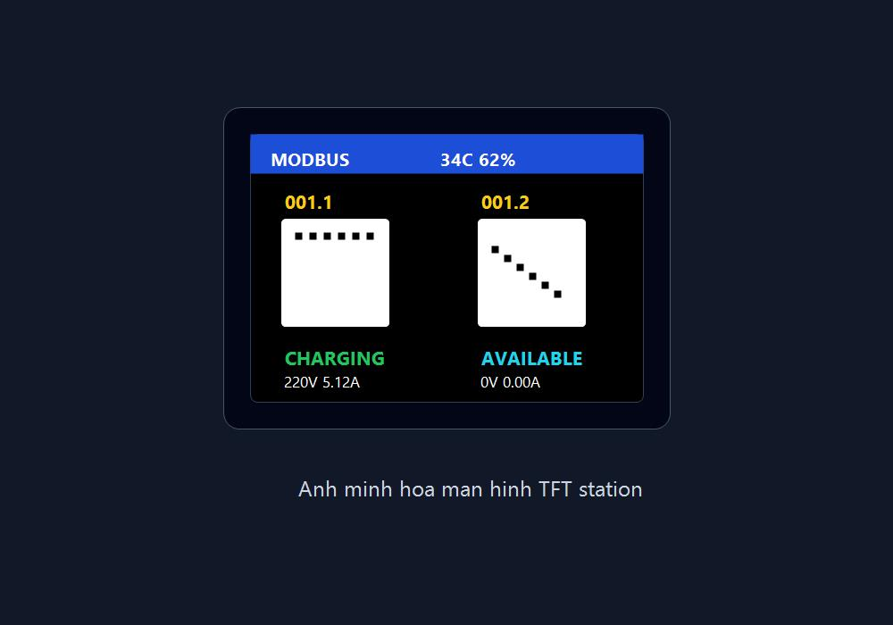
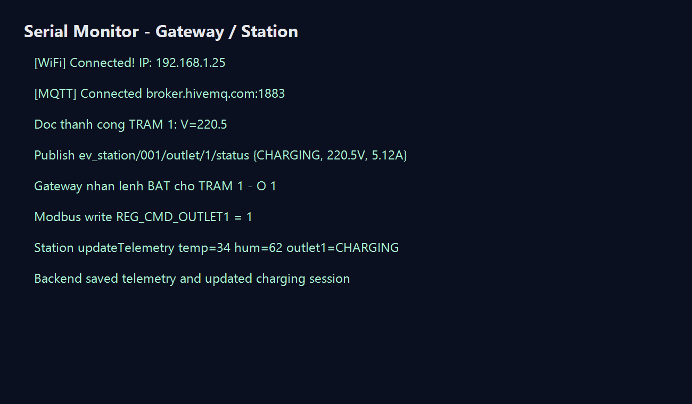

# Phu luc ky thuat

Tai lieu nay tom tat cac thong tin ky thuat quan trong de hoi dong co the xem nhanh cau truc, giao tiep va cach van hanh he thong tram sac xe dien.

## A. Kien truc tong the


He thong chia thanh 4 lop:

1. Lop thiet bi: ESP32 Station, relay, PZEM-004T, DHT11, TFT ST7735 va nut BOOT.
2. Lop gateway: ESP32 Gateway lam Modbus master va MQTT client.
3. Lop dich vu: backend Node.js, MQTT broker va MySQL.
4. Lop giao dien: Web admin va ung dung di dong Expo.

## B. So do ket noi phan cung


### B.1. Station ESP32

| Nhom | Chan / giao tiep | Chuc nang |
| --- | --- | --- |
| RS485 | RX 18, TX 19 | Modbus RTU slave |
| TFT ST7735 | CS 32, RST 33, DC 25, MOSI 26, SCLK 27 | Hien thi QR va trang thai |
| PZEM cong 1 | RX 16, TX 17 | Do dien ap, dong dien, cong suat cong 1 |
| PZEM cong 2 | RX 3, TX 1 | Do dien ap, dong dien, cong suat cong 2 |
| Relay | GPIO 21, GPIO 22 | Dong/ngat 2 cong sac, active LOW |
| DHT11 | GPIO 4 | Nhiet do va do am |
| Nut BOOT | GPIO 0 | Giu 5 giay de bat/tat WiFi AP OTA |

### B.2. Gateway ESP32

| Nhom | Chan / giao tiep | Chuc nang |
| --- | --- | --- |
| RS485 | RX 18, TX 19 | Modbus RTU master |
| WiFi | STA mode | Ket noi MQTT broker |
| MQTT | broker.hivemq.com:1883 | Gui telemetry va nhan lenh dieu khien |

## C. Modbus register map

| Register | Ten | Kieu gia tri | Mo ta |
| --- | --- | --- | --- |
| 0 | `REG_TEMP` | x1 | Nhiet do |
| 1 | `REG_HUM` | x1 | Do am |
| 2 | `REG_OUTLET1_STATUS` | 0/1 | Cong 1 san sang/dang sac |
| 3 | `REG_OUTLET1_V` | x10 | Dien ap cong 1 |
| 4 | `REG_OUTLET1_A` | x100 | Dong dien cong 1 |
| 5 | `REG_OUTLET1_W` | x10 | Cong suat cong 1 |
| 6 | `REG_OUTLET2_STATUS` | 0/1 | Cong 2 san sang/dang sac |
| 7 | `REG_OUTLET2_V` | x10 | Dien ap cong 2 |
| 8 | `REG_OUTLET2_A` | x100 | Dong dien cong 2 |
| 9 | `REG_OUTLET2_W` | x10 | Cong suat cong 2 |
| 10 | `REG_CMD_OUTLET1` | -1/0/1 | Lenh tat/bat cong 1 |
| 11 | `REG_CMD_OUTLET2` | -1/0/1 | Lenh tat/bat cong 2 |
| 12 | `REG_MAX_CURRENT` | x100 | Gioi han dong sac |
| 13 | `REG_TEMP_LIMIT` | x1 | Gioi han nhiet do |
| 14 | `REG_STATION_STATUS` | 0/1 | Online/maintenance |

## D. MQTT topic va payload

### D.1. Telemetry

Topic:

```text
ev_station/001/outlet/1/status
ev_station/001/outlet/2/status
```

Payload mau:

```json
{
  "station_id": "001",
  "outlet_id": 1,
  "status": "CHARGING",
  "voltage": 220.5,
  "current": 5.12,
  "power": 1128.9,
  "temperature": 34,
  "humidity": 62
}
```

### D.2. Lenh dieu khien

Topic:

```text
ev_station/001/outlet/1/cmd
```

Payload:

```json
{ "command": "START_CHARGE" }
```

hoac:

```json
{ "command": "STOP_CHARGE" }
```

### D.3. Cau hinh station

Topic:

```text
ev_station/001/config
```

Payload:

```json
{
  "max_current": 16,
  "temp_limit": 65,
  "status": "online"
}
```

## E. API backend

| Method | Endpoint | Chuc nang |
| --- | --- | --- |
| POST | `/api/login` | Dang nhap |
| POST | `/api/register` | Dang ky nguoi dung |
| POST | `/api/forgot-password` | Gui OTP quen mat khau |
| POST | `/api/reset-password` | Dat lai mat khau |
| GET | `/api/user/me` | Lay thong tin nguoi dung |
| POST | `/api/user/change-password` | Doi mat khau |
| GET | `/api/stations` | Lay danh sach tram va trang thai |
| PUT | `/api/stations/price` | Cap nhat gia dien |
| PUT | `/api/stations/:id` | Cap nhat cau hinh tram |
| POST | `/api/charge/start` | Bat dau sac |
| POST | `/api/charge/stop` | Dung sac |
| GET | `/api/sessions/history` | Lich su phien sac |
| DELETE | `/api/sessions/history` | Xoa lich su phien sac |
| GET | `/api/telemetry/history` | Lich su telemetry |
| POST | `/api/payment/webhook` | Webhook nap tien |
| GET | `/api/user/topup-history` | Lich su nap tien |
| DELETE | `/api/user/topup-history` | Xoa lich su nap tien |
| GET | `/api/users` | Admin xem danh sach nguoi dung |
| POST | `/api/users/register` | Admin tao nguoi dung |
| POST | `/api/users/add_balance` | Admin nap tien thu cong |
| DELETE | `/api/users/:id` | Admin xoa nguoi dung |

## F. Co so du lieu

Schema chinh nam tai `database.dbml`. Co the dung dbdiagram.io de mo va xuat ERD.

Bang chinh:

- `users`: tai khoan, email, role, balance.
- `stations`: ma tram, ten, vi tri, gia dien, trang thai.
- `telemetry`: du lieu thoi gian thuc theo tung cong sac.
- `charging_sessions`: phien sac va chi phi.
- `topup_history`: log nap tien tu webhook ngan hang.

## G. Quy trinh demo goi y

1. Khoi dong MySQL va backend.
2. Mo web admin tai `http://localhost:3000`.
3. Nap firmware gateway va station.
4. Kiem tra gateway ket noi WiFi/MQTT.
5. Station hien QR `001.1` va `001.2` tren TFT.
6. Dang nhap app, quet QR hoac chon cong sac trong danh sach.
7. Bat dau sac, quan sat relay dong, PZEM co du lieu va dashboard cap nhat.
8. Dung sac, kiem tra lich su phien sac va so du vi.
9. Thu tinh nang bao ve bang nguong dong/nhiet do va che do maintenance.

## H. Anh ket qua demo

| Hinh | Mo ta |
| --- | --- |
|  | Giao dien web admin |
|  | Ung dung di dong |
|  | Man hinh TFT tren station |
|  | Log Serial/MQTT/Modbus |

## I. Ghi chu bao mat

Repo hien co cac vi tri can thay bang bien moi truong truoc khi public:

- WiFi SSID/password trong firmware gateway.
- Tai khoan admin mac dinh, JWT secret va webhook secret trong backend.
- Thong tin ngan hang/URL backend public trong app neu can an danh.

Nen them file `.env.example` va khong commit `.env` that.
